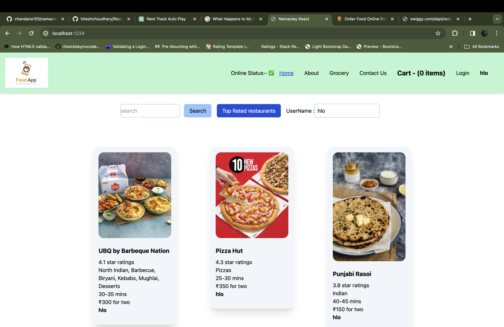
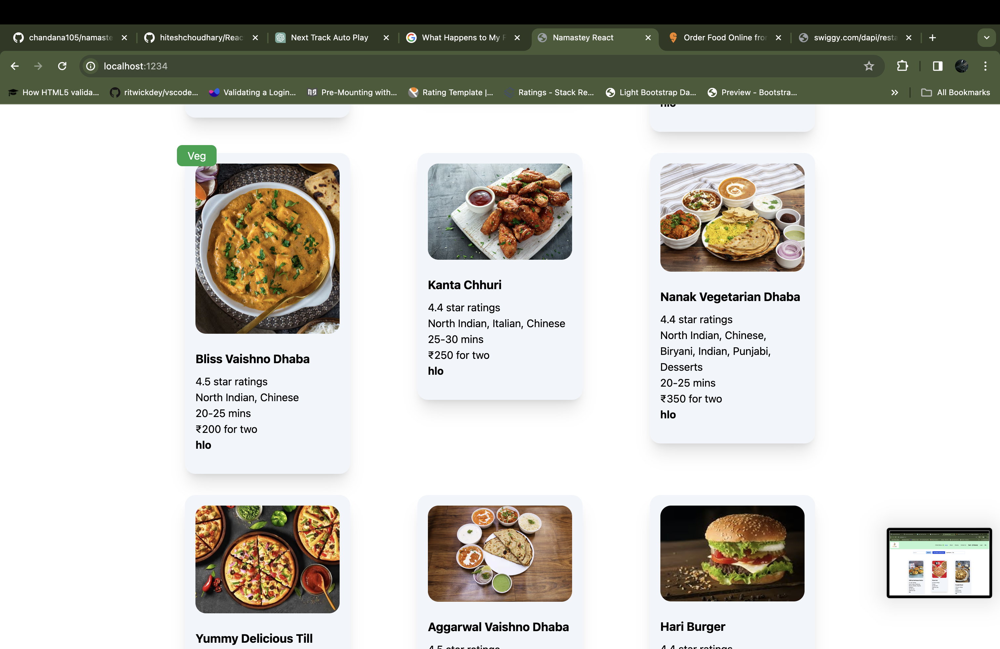
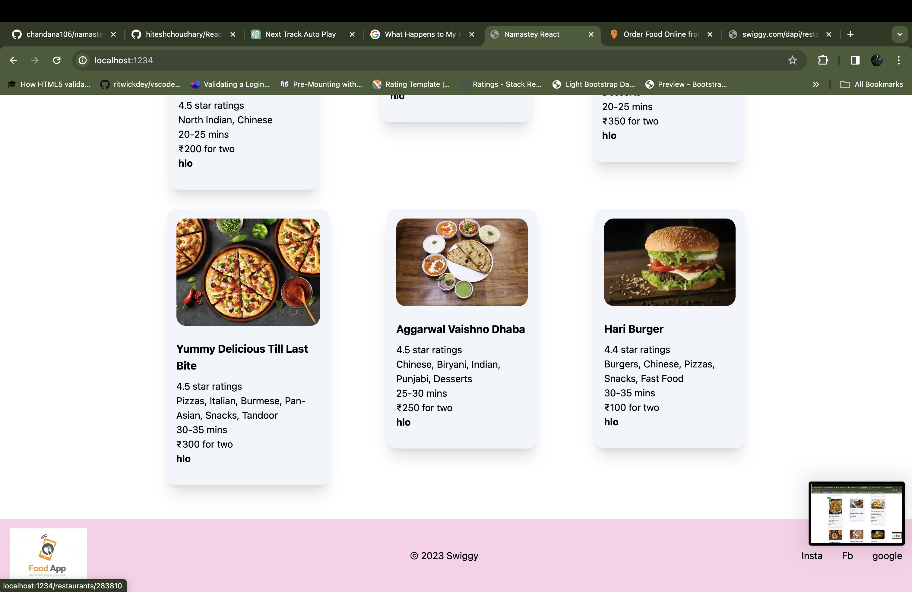
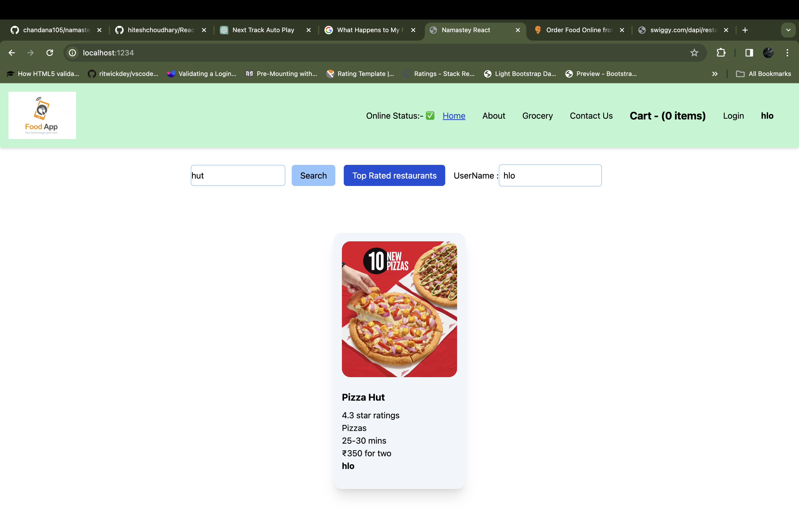
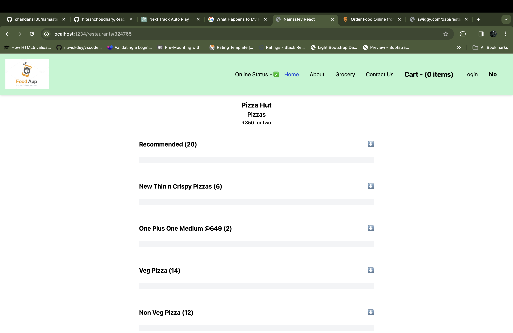
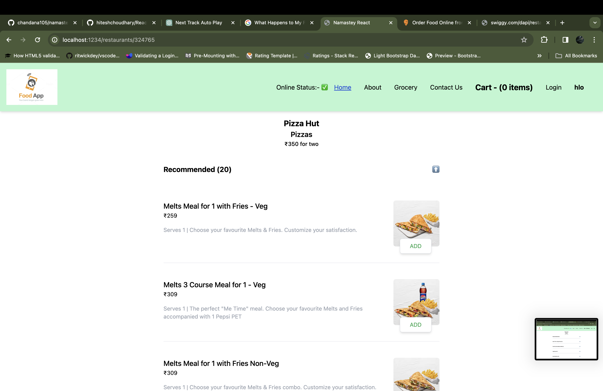
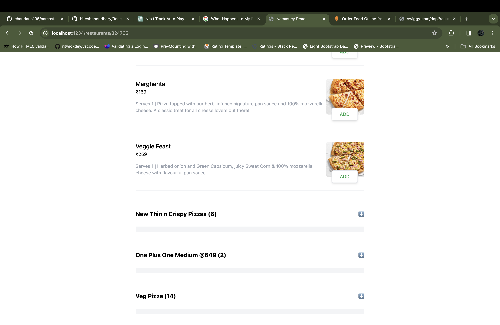
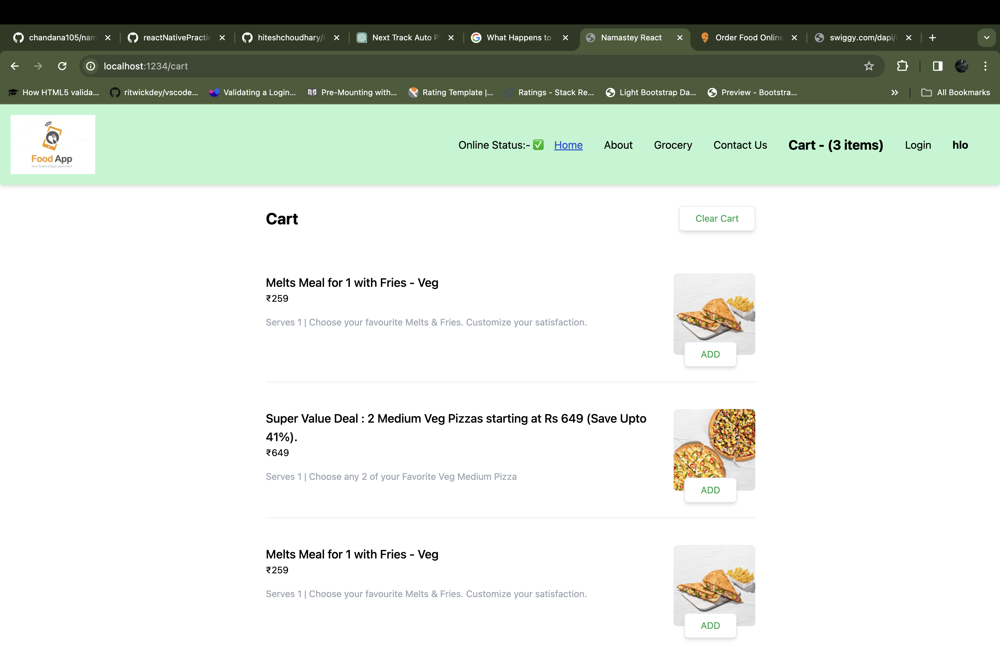

# FOOD ORDERING WEB APPLICATION / SWIGGY CLONE

A comprehensive web application for food ordering, inspired by Swiggy.

- Live demo : [FoodOrderingWebApplication]

## Tech Stack
- Frontend
   - React: JavaScript library for building user interfaces.
   - Redux Toolkit: State management library for handling application state.
   - React Infinite Scroll Component: Infinite scrolling functionality for React.
   - React Modal: Accessible modal dialog component for React
   - React Spinners: Collection of loading spinner components for React.
   - React Icons: Library of popular icons for React applications.
   - TailwindCSS: Utility-first CSS framework for rapid UI development.
- Build Tools
   - Parcel: Blazing fast, zero configuration web application bundler.
- Others
   - Babel: JavaScript compiler to convert ECMAScript 2015+ code into a backwards-compatible version of JavaScript.
- Development Environment
   - Visual Studio Code: Code editor redefined and optimized for building and debugging modern web and cloud applications.

## Features
- Restaurants Listing Page : A page displaying all the fetched restaurants from the API, differentiating between veg and non-veg restaurants.
- Search Filter: Enables searching for restaurants based on name.
- Top Rated Restaurant Filter: Filter to show top-rated restaurants.
- Restaurant Menu Page :-
   - Displays the description of the restaurant.
   - Renders the restaurant's menu with different categories using infinite scrolling.
   - Toggles the restaurant category.
   - Add to Cart: Add items to the cart.
   - Remove from Cart: Remove items from the cart.
   - Increase/Decrease Quantity: Adjust the quantity of items in the cart.
   - Replace Cart Item Modal: Modal to replace items in the cart.
- Cart Page
   - Displays total items in the cart of a particular restaurant with infinite scrolling.
   - Clear Cart Modal: Modal to clear all items in the cart.
   - Displays the total order amount.
- Responsive Design: Ensures the application is responsive across different screen sizes.

### Screenshots of app

## todo

- TODO: update final screenshots
- TODO: add to netlify
- TODO: update readme
- TODO: change Place order nad show Orer totoal :- in green
- TODO: push to branch main

